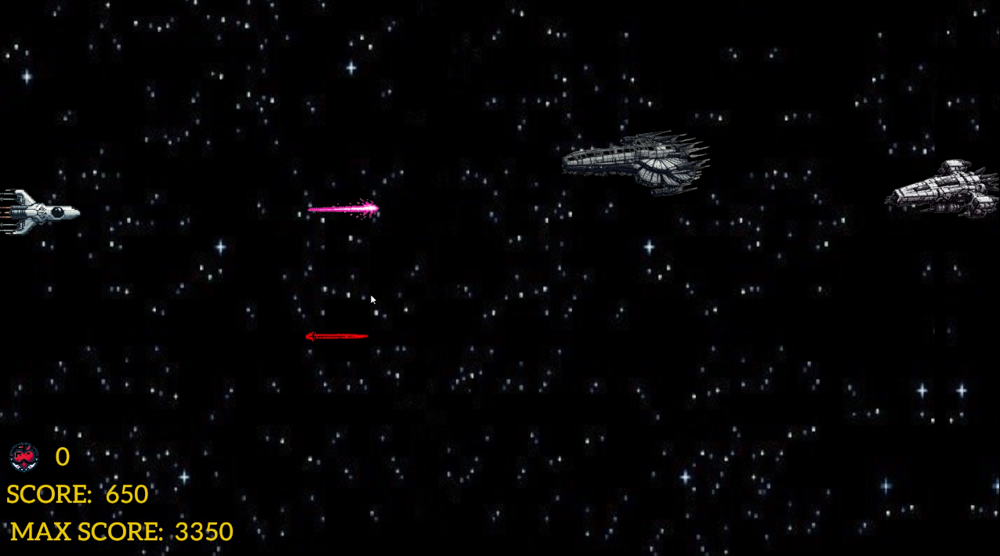
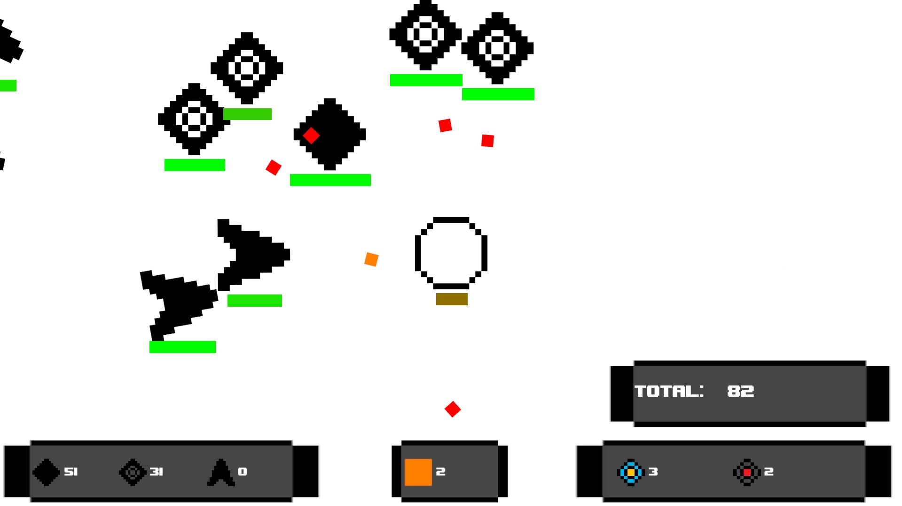
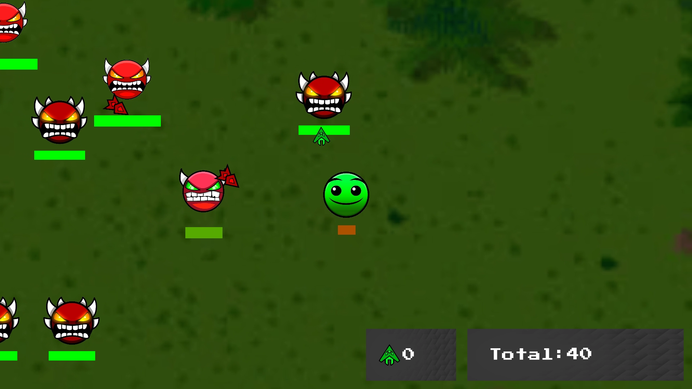

# 🎮 Mis Juegos de Unity

Bienvenido al repositorio de mis juegos desarrollados en **Unity** usando **C#**. Aquí encontrarás tres juegos 2D con mecánicas únicas y un estilo visual divertido y desafiante. A continuación, te presento cada uno de los juegos, con una breve descripción y sus características principales. ¡Espero que los disfrutes!

---

## 📚 Juegos en este repositorio

### 🚀 Space Terrorist

*Space Terrorist* es un emocionante juego 2D de combate espacial en el que manejas una nave y debes eliminar a los enemigos que se acercan. A medida que avanzas, desbloqueas **superpoderes** que te ayudan a sobrevivir y a ganar puntos.

- Dos tipos de enemigos con diferentes comportamientos.
- Superpoderes que se desbloquean con el progreso del juego:
  - **x2 de puntos**: Duplica los puntos obtenidos.
  - **Disparo triple**: Aumenta la potencia de ataque.
  - **Vida extra**: Gana una vida adicional.

**Tecnología utilizada:** Unity, C#

---

### ⚔️ Form Warfare

*Form Warfare* es un juego de supervivencia donde controlas un **círculo pixelado** que debe derrotar oleadas de **rombos** enemigos. Cada enemigo tiene su propia categoría y dificultad, y puedes recoger mejoras que te ayudan a resistir en el campo de batalla.

- Diferentes tipos de enemigos con habilidades únicas.
- Potenciadores que puedes obtener:
  - **Aumento de velocidad de disparo**: Dispara con mayor rapidez.
  - **Incremento de daño**: Los disparos causan más daño.
  - **Curación**: Recupera vida.
- Armamento que puedes obtener:
  - **Bomba**: Elimina a todos los enemigos en pantalla al activarse.
  - **Disparo**: Dispara una bala naranja de forma automatica cuando estas a cierta distancia del enemigo.

**Tecnología utilizada:** Unity, C#

---

### 🎩 Dash Survivors

*Dash Survivors* es una versión de *Form Warfare* con una estética inspirada en **Geometry Dash**. En este juego, controlas el ícono de **Geometry Dash de dificultad normal** y te enfrentas a enemigos con el aspecto de **demonios** de Geometry Dash. La mecánica de juego es similar, pero el cambio de sprites le da un estilo visual único.

- Inspirado en Geometry Dash.

**Tecnología utilizada:** Unity, C#

---

## 💾 Cómo Descargar los Juegos desde GitHub

Para descargar y jugar estos juegos desde GitHub, sigue estos pasos:

1. **Descargar el repositorio**: Busca el botón **Code** en la parte superior derecha de la lista de archivos y haz clic en él. Luego selecciona **Download ZIP** para descargar todo el repositorio en un archivo comprimido.

   > **Imagen sugerida:** Captura de pantalla del menú desplegable **Code** mostrando la opción **Download ZIP**.

2. **Extraer el archivo ZIP**: Una vez descargado, localiza el archivo ZIP en tu computadora y extrae su contenido en la ubicación que prefieras.

   > **Imagen sugerida:** Captura de pantalla del archivo ZIP extraído y mostrando las carpetas de los juegos.

3. **Seleccionar el juego y sistema operativo**: Dentro de la carpeta del repositorio descargado, elige el juego que quieres jugar (`Space Terrorist`, `Form Warfare`, o `Dash Survivors`). Dentro de cada una de estas carpetas, encontrarás dos subcarpetas, una para **Linux** y otra para **Windows**. Abre la carpeta correspondiente a tu sistema operativo.

   > **Imagen sugerida:** Captura de pantalla mostrando las subcarpetas de cada juego para Linux y Windows.

4. **Ejecutar el juego**: Una vez abierto el proyecto en Unity, haz clic en "Play" para comenzar a jugar.

   > **Imagen sugerida:** Captura de pantalla de la interfaz de Unity con el botón "Play" seleccionado y la vista del juego lista para empezar.
